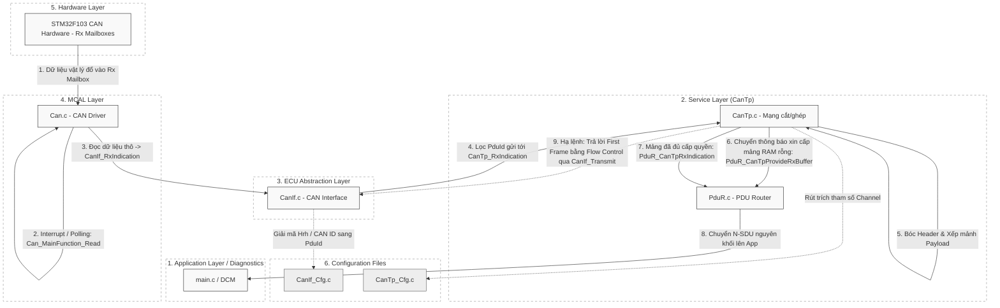

# Tài Liệu Chuyên Sâu: Luồng Xử Lý Nhận Dữ Liệu CanTp (CanTp Receive)

## 1. Giới thiệu Module CanTp (Rx)

Ở phía Node thu tín hiệu, **CanTp Receive (Rx)** đảm nhiệm trọng trách phức tạp hơn rất nhiều so với Truyền: **Tái tổ hợp (Reassembly)**. Trong một hệ thống vận hành thực tế ở tốc độ cao, các mảnh dữ liệu (N-PDU) bay lơ lửng trên Bus CAN như những cơn mưa rào và có thể bị ngắt quãng. CanTp nhận nhiệm vụ "Hứng mảnh vỡ" từ Hardware, sắp xếp lại thành bức tranh trọn vẹn (SDU nguyên thủy tối đa 4095-bytes) và vác lên giao lại cho Ứng dụng.

Luồng Rx cực kỳ phức tạp vì nó chứa khái niệm *Đàm phán tốc độ nhận (Flow Control)*, ép bên gửi (Tx) phải hãm phanh gửi đúng với tốc độ mà bộ nhớ đệm (RAM) bên Nhận có thể bao tiêu.

---

## 2. Sơ Đồ Kiến Trúc Luồng Rx (Từ Hardware lên Application)

---

## 3. Hoạt Động Chi Tiết (Từng Bước)

### Bước 1: Hardware Bắt Tín Hiệu Thô (`Can_MainFunction_Read`)
- Mạng CAN trên cáp đồng có giao động điện áp. Bộ lọc vật lý của RX Mailbox chụp dính được một chuỗi 8 bytes với mã CAN ID chuẩn.
- Báo hiệu ngắt, tầng MCAL lôi chuỗi 8 bytes đó ra, tra soát, và phân phối lên cho `CanIf`. CanIf dò tìm cấu hình Routing và điếm chuyển `RxIndication` thẳng cho `CanTp_RxIndication()`.

### Bước 2: Nhận Dạng Cấu Trúc Khung Nhận (N_PCI)
Ngay khi có Frame mới (Max 8 bytes), lõi CanTp rút lấy nửa/Một Byte đầu tiên (N_PCI) để đánh giá "Tư cách" của khung báo:
1. **Nếu là Single Frame (SF - Khung Lẻ):**
   - Dữ liệu nằm gọn trong 7 bytes trở xuống. CanTp gọi thẳng tầng trên `PduR_CanTpProvideRxBuffer` để xin bộ đệm RAM vừa khít 7 bytes.
   - Nhét Data, đóng lệnh và kết thúc cuộc giao dịch bằng hàm `PduR_CanTpRxIndication()`. 

2. **Nếu là First Frame (FF - Cảnh Báo Gói Lớn):**
   - Sự kiện nghiêm trọng! FF mang theo thông số tổng cộng kích cỡ gói SDU rất lớn chuẩn bị đổ bộ.
   - CanTp lật đật chạy lên `PduR` xin một mảnh Ram tổng khổng lồ (vừa đúng dung lượng công bố từ Tx).

### Bước 3: Phê Duyệt Tín Chấp & Bắn Còi Lưu Lượng (Flow Control)
- Nếu App / PduR đồng ý phân bổ RAM (ví dụ một con trỏ Pointer `RxBuffer`), CanTp biết chắc chắn đã có kho tải.
- Tại chu kỳ Update kế tiếp (`CanTp_MainFunction()`), nhằm chống lại việc luồng RX nhồi ứa bộ đệm, CanTp chủ động biên chế một gói điều hướng **Flow Control (FC)**. 
- Gọi hàm `CanIf_Transmit` bắn lệnh bóp phanh sang node kia: *"FS=0 (Continue), BS=0 (Cho phép bắn thẳng không nghỉ), STmin=0x14 (Khoảng cách 20ms mỗi mảnh)"*.

### Bước 4: Kỹ Thuật Bắt Lỗi Mảnh Nối Liền (Consecutive Frames)
- Lâu dần, bên TX bắt đầu nháy liên tiếp các **Consecutive Frames (CF)** về phía CanTp. 
- Hàm `CanTp_RxIndication()` chụp lại cất đi. Đặc biệt: Nó đối chiếu mã thứ tự `Sequence Number (SN)` (0,1,2,..,15) của mỗi CF để xem có mảnh nào bị rơi gãy không. 
- Nếu `SN` bị nhảy cóc (vd: Đang 2 tự nhiên lên 4), CanTp báo lỗi hỏng toàn bộ cục truyền, đập bỏ phi vụ.
- Nếu `SN` hợp lệ song hành, Data được bóc ra và dán thẳng theo Index vào mảng RAM lớn (khởi đầu từ BufferPtr của phía App).

### Bước 5: Bàn Giao Tác Phẩm Kỷ Lục (`PduR_CanTpRxIndication`)
- Hàm `CanTp_RxIndication` đóng sổ kế toán bộ đếm (Byte Receive Counter). Khi số byte hút được bằng đúng (hoặc quá 1-2 padded byte) với tổng SDU từ bấy lâu... 
- Gói tin được chốt hạ thành công. Hàm `CanTp` xóa hết sổ nợ của kênh.
- Tuyên bố hoàn thành công tác gửi PDU lên thông qua `PduR_CanTpRxIndication(E_OK)`. Ứng dụng Main/DCM lấy ra 4095 Bytes sử dụng nguyên vẹn.

> [!WARNING]
> **Bộ đứt Gãy Mạng Cục Bộ (Timeout N_Cr):**
> Điều cực kì lợi hại trong hệ thống RX là khả năng bẻ khóa vô hạn (Infinite Lock).
> Khi CanTp vừa nhận xong mảnh FF (Nằm yên há miệng chờ đổ CF).
> Nếu Node TX bỗng nhiên bị đoản mạch và không thèm rót tín hiệu CF về nữa.
> Lúc này, cái đồng hồ đếm lùi Timeout chuyên biệt `N_Cr` sẽ nổ hỏa tiễn sau khoảng 1 giây (được Config trước).
> CanTp tự động "đá bay" mớ Data hiện hữu vào bộ nhớ rác, giải phóng kênh truyền ngay lại, tránh con chip chết đứng vì thiếu RAM đệm và tài nguyên vĩnh viễn!
