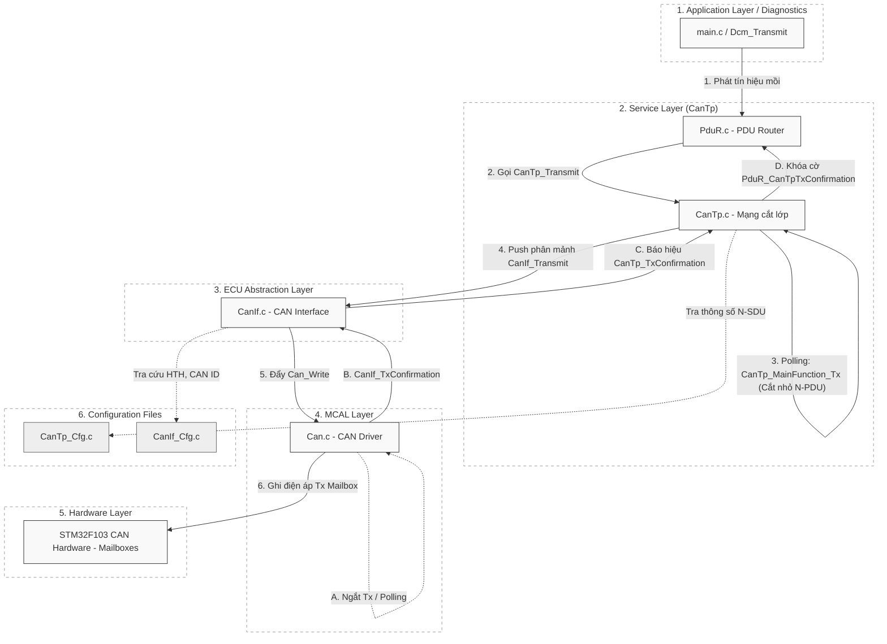

# Tài Liệu Chuyên Sâu: Luồng Xử Lý Truyền Dữ Liệu CanTp (CanTp Transmit)

## 1. Giới thiệu Module CanTp (Tx)

**CanTp (CAN Transport Protocol)** là trái tim của giao thức truyền thông chẩn đoán (Diagnostics) trong mạng lưới xe hơi theo chuẩn AUTOSAR & ISO 15765-2. Vì khung mạng CAN cơ bản (Classical CAN) chỉ có thể tải tối đa **8 bytes** dữ liệu mỗi gói, CanTp giải quyết bài toán làm thế nào để truyền được những gói thông điệp khổng lồ (VD: 4095 bytes) bằng cách **cắt nhỏ (Segmentation)** gói lớn thành nhiều khung 8-byte và truyền tải lần lượt.

Luồng Tx chịu trách nhiệm đóng gói PDU khổng lồ từ tầng trên (App/Dcm) thành các mảnh N-PDU nhỏ xíu và quăng xuống bộ điều khiển CAN (Hardware).

---

## 2. Sơ Đồ Kiến Trúc Luồng Tx (Từ Application xuống Hardware)

---

## 3. Hoạt Động Chi Tiết (Từng Bước)

### Bước 1: Khởi nguồn yêu cầu (`CanTp_Transmit`)
- Tầng trên cùng (Application hoặc Dcm) quyết định gửi một mảng dữ liệu (Ví dụ: Mảng báo lỗi 20 bytes).
- Lời gọi API chạy từ trên xuống tới hàm `CanTp_Transmit(TxPduId, PduInfoPtr)`.
- CanTp kiểm tra trạng thái kênh truyền (Channel State). Nếu kênh đang bận truyền gói khác, nó có thể từ chối (`E_NOT_OK`).
- Nếu kênh rảnh, trạng thái State Machine của kênh được kích hoạt thành `CANTP_TX_PROCESSING`. CanTp lưu lại chiều dài chuỗi (SDU Length) và con trỏ dữ liệu.

### Bước 2: Phân tích kích cỡ & Tạo Header (N_PCI)
Trong hàm Polling (`CanTp_MainFunction()`), CanTp tiến hành tính toán độ dài Dữ liệu (SduLength):
- **Trường hợp SduLength <= 7 bytes:**
  - CanTp gói toàn bộ Data và chèn 1-byte Header gọi là **Single Frame (SF)**. Truyền thẳng một lần duy nhất mà không cần đàm phán gì thêm.
- **Trường hợp SduLength > 7 bytes:** (Phải băm nhỏ thành gói)
  - Mảnh đầu tiên được đóng gói với Header là **First Frame (FF)** (mang theo tổng độ dài SDU + 6 bytes data đầu tiên).
  - CanTp chuyển sang trạng thái chờ *Flow Control*.

### Bước 3: Đẩy khung CAN xuống lớp Dưới (`CanIf_Transmit`)
- Sau khi đóng gói xong Header và Data, CanTp gọi hàm `CanIf_Transmit()` của lớp CAN Interface.
- Lớp `CanIf` sẽ đối chiếu bảng Routing để chuyển PDU ảo thành CAN ID vật lý và chuyển cho Driver `Can.c` ghi xuống thanh ghi Hardware vi điều khiển. 

### Bước 4: Nhận Chứng Thực Mạch Phản Hồi (`CanTp_TxConfirmation`)
- Sau khi Hardware phóng điện thành công trên Bus CAN, nó nảy một ngắt phần cứng (Hardware Tx Interrupt) hoặc thông báo qua Polling.
- Dòng chảy đi ngược lên: `Can.c` báo cho `CanIf.c` -> báo cho `CanTp_TxConfirmation()`.
- CanTp ghi nhận sự kiện này. Nếu gói vừa truyền là First Frame, nó nằm im chờ Node đối diện phản hồi lại một gói báo hiệu "Đã sẵn sàng" (Flow Control Frame).

### Bước 5: Truân chuyển Khung Kế Tiếp (Cho gói lớn)
- Khi Node đối diện phản hồi 1 frame tên là `FlowControl (FC)`, CanTp nhận lệnh "Được phép gửi tiếp" kèm theo Block Size (BS) và Separation Time (STmin).
- Các chu kỳ Tick tiếp theo của hàm `CanTp_MainFunction()` sẽ tiến hành gọt mảng dữ liệu mẹ ra thành các nhánh 7-byte. Đóng gói Header chập vào thành **Consecutive Frame (CF)** và lập tức gửi qua `CanIf_Transmit`.
- Hành động này lặp lại liên tiếp chừng nào đếm đủ Block Size (BS), hoặc cho tới khi số mảng byte băm hết.

### Bước 6: Thông cáo Hoàn Thành (`PduR_CanTpTxConfirmation`)
- Khi bit dữ liệu rốt ráo cuối cùng đã rời khỏi mạch điện và nhận đủ Confirm từ Hardware, `CanTp` dọn dẹp cờ trạng thái, đưa kênh về nghỉ (Idle).
- Gọi báo cáo cho tầng trên `PduR_CanTpTxConfirmation()` biết Quá trình nung nấu và phát hỏa truyền thông đã hoàn thành!

> [!CAUTION]
> **Bộ đếm Thời Gian Nguy Hiểm (Timeout)**:
> Trong toàn bộ quá trình, CanTp quản lý chặt chẽ hệ thống Timer theo chuẩn ISO 15765-2 (N_As, N_Bs, N_Cs).
> Nếu việc Hardware bị kẹt mạng quá lâu (`Can_Write` không trả `TxConfirmation` = TimeOut N_As), 
> Hoặc gửi FF xong mãi mà bên nhận bặt vô âm tín không thèm chọi FC về (TimeOut N_Bs).
> CanTp sẽ huỷ trạng thái kênh, rớt mạng, và báo lỗi khẩn cấp (`E_NOT_OK`) lên App lập tức! 
> Tính năng Timeout này giữ bảo vệ mạch không bao giờ bị đứng máy vĩnh viễn chờ luồng ảo.
