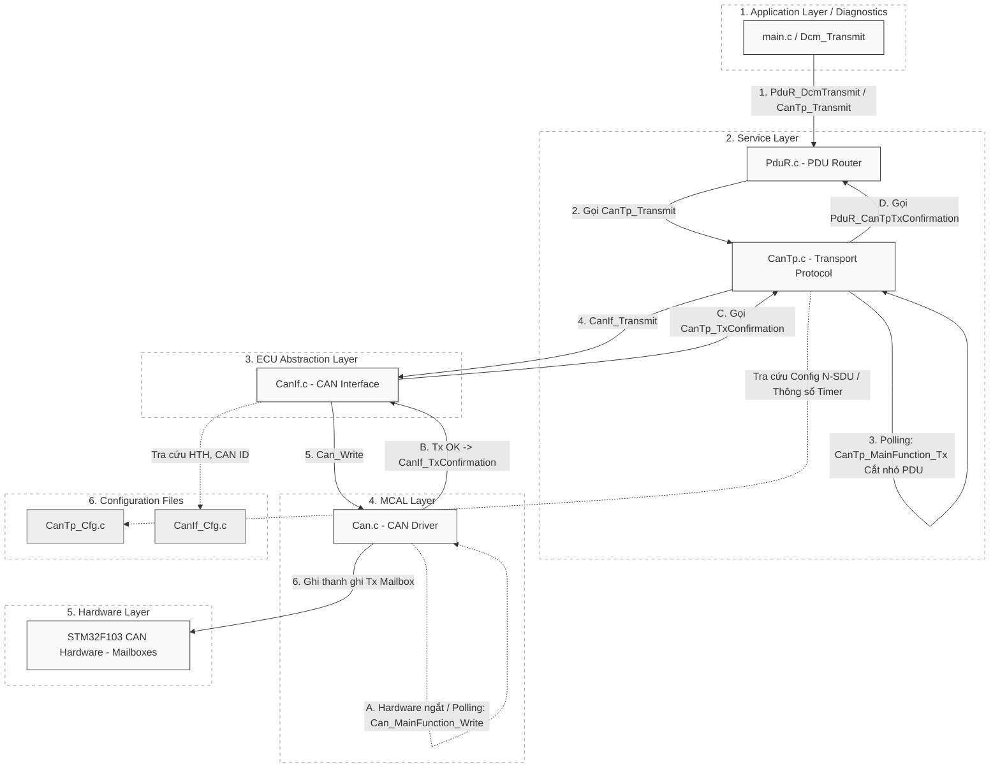
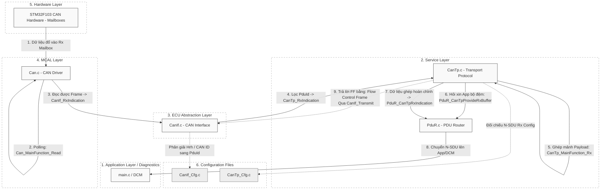

# Sơ đồ Kiến trúc Luồng Dữ liệu CanTp (AUTOSAR COM Stack)

Dựa trên hình ảnh sơ đồ kiến trúc lớp AUTOSAR mà bạn đã cung cấp, tôi đã xây dựng lại 2 sơ đồ Tương đương dành riêng cho luồng **CanTp (Truyền)** và **CanTp (Nhận)**.

Chúng thể hiện rõ cách Dữ liệu (PDU) đi xuyên qua các lớp: *Application -> Service (PduR, CanTp) -> ECU Abstraction (CanIf) -> MCAL (Can) -> Hardware*.

---

## 1. Sơ đồ Luồng CanTp Truyền (CanTp Transmit)

Sơ đồ này mô tả khi Ứng dụng (hoặc DCM) muốn truyền một mảng dữ liệu lớn (Diagnostics) xuống mạng CAN, CanTp sẽ làm nhiệm vụ phân mảnh (Segmentation) từ N-SDU thành các N-PDU nhỏ.

---

## 2. Sơ đồ Luồng CanTp Nhận (CanTp Receive)

Sơ đồ này mô tả khi Mạch (Hardware) bắt được một chuỗi các khung CAN (N-PDU như Single Frame, First Frame, Consecutive Frames), tín hiệu sẽ được truyền theo chiều từ dưới lên để CanTp ghép lại (Reassembly) thành một N-SDU hoàn chỉnh. 

---
> [!TIP]
> **Điểm chú ý trong CanTp:**
> Không giống như module `Com.c` thông thường chỉ đẩy Data xuống 1 lần là xong. Lớp `CanTp.c` là một "Cỗ máy trạng thái (State Machine)". Do quá trình truyền và nhận bị chia cắt thành nhiều khung CAN nhỏ rải rác theo thời gian, module `CanTp` sẽ dựa dẫm rất nhiều vào sự sống của hàm `CanTp_MainFunction` để cắt/ghép và gửi đi từng mảnh ở mỗi chu kỳ sống (Tick) của chương trình. Đây là lý do ở lượt gỡ lỗi trước, nếu bạn chỉ bấm (F10) 1 lần, hàm MainFunction chưa kịp nhả mảnh tiếp theo, dẫn đến dữ liệu không thể hoàn thiện!
